# 🔄 Menu Item Deletion Flow - Visual Guide

## The Problem (Before Fix)

```mermaid
graph TD
    A[Admin clicks Delete button 🗑️] --> B[Confirmation dialog]
    B -->|OK| C[DELETE /api/menu/:id]
    C --> D[Try to delete from database]
    D --> E{Has order history?}
    E -->|Yes| F[❌ Prisma foreign key error]
    F --> G[Generic error message]
    G --> H[😢 Item still there, admin confused]
    E -->|No| I[✅ Successfully deleted]
```



**Issues:**
- ❌ Foreign key constraint error not handled
- ❌ No helpful error message
- ❌ Admin doesn't know what to do
- ❌ Data integrity at risk

---

## The Solution (After Fix)

```mermaid
graph TD
    A[Admin clicks Delete button 🗑️] --> B[Confirmation: Delete 'Samosa'?]
    B -->|Cancel| Z[No action]
    B -->|OK| C[DELETE /api/menu/:id]
    
    C --> D[🔍 Check order history]
    D --> E{Has orders?}
    
    E -->|NO| F[✅ Safe to delete]
    F --> G[Delete from database]
    G --> H[✅ Success: Item removed]
    
    E -->|YES| I[🛑 Return 409 Conflict]
    I --> J[Error: 'Cannot delete - has order history']
    J --> K[💡 Suggestion: Mark as unavailable]
    K --> L{Admin chooses}
    
    L -->|Cancel| M[Item stays as-is]
    L -->|Mark Unavailable| N[PUT /api/menu/:id]
    N --> O[Update: isAvailable = false]
    O --> P[✅ Item hidden from customers]
    P --> Q[✅ Order history preserved]
```



**Benefits:**
- ✅ Proactive order history check
- ✅ Clear, actionable error messages
- ✅ One-click alternative solution
- ✅ Data integrity guaranteed

---

## Code Flow Comparison

### ❌ BEFORE (Broken)

```typescript
// Backend: No order history check
async function DELETE() {
  await prisma.menuItem.delete({ where: { id } });
  return { success: true };
}
// Result: Foreign key error if item has orders

// Frontend: Generic error handling
if (!response.ok) {
  alert('Failed to delete item'); // Unhelpful
}
```

### ✅ AFTER (Fixed)

```typescript
// Backend: Smart deletion
async function DELETE() {
  // 1. Check order history FIRST
  const hasOrders = await prisma.orderItem.findFirst({
    where: { menuItemId: id }
  });

  // 2. Prevent if has orders
  if (hasOrders) {
    return {
      success: false,
      hasOrders: true,
      error: 'Cannot delete - item has been ordered',
      suggestion: 'Mark as unavailable instead'
    };
  }

  // 3. Safe to delete
  await prisma.menuItem.delete({ where: { id } });
  return { success: true };
}

// Frontend: Smart error handling
if (response.status === 409 && data.hasOrders) {
  // Show helpful dialog with alternative
  const markUnavailable = confirm(
    `⚠️ ${data.error}\n\n` +
    `💡 ${data.suggestion}\n\n` +
    `Mark "${name}" as unavailable instead?`
  );

  if (markUnavailable) {
    // One-click fix
    await updateItem({ ...item, isAvailable: false });
  }
}
```

---

## Database Relationship

```
┌─────────────────┐         ┌─────────────────┐
│   MenuItem      │         │   OrderItem     │
├─────────────────┤         ├─────────────────┤
│ id (PK)         │◄────────│ menuItemId (FK) │
│ name            │ 1     * │ orderId         │
│ price           │         │ quantity        │
│ isAvailable     │         │ price           │
└─────────────────┘         └─────────────────┘

❌ Cannot delete MenuItem if OrderItem references it
   (Foreign key constraint)

✅ Solution: Mark MenuItem as unavailable
   (isAvailable = false)
```

---

## User Experience Flow

### Scenario 1: New Menu Item (No Orders)

```
1. Admin: "Delete 'New Dish'"
2. System: ✅ "No orders found"
3. System: 🗑️ Deletes item
4. Result: Item removed completely
```

### Scenario 2: Popular Menu Item (Has Orders)

```
1. Admin: "Delete 'Samosa'"
2. System: 🔍 "Found 1,000+ orders"
3. System: 🛑 "Cannot delete"
4. System: 💡 "Mark as unavailable instead?"
5. Admin: "Yes"
6. System: ✅ Updates isAvailable = false
7. Result: 
   - Hidden from customer menu
   - Order history preserved
   - Analytics intact
```

---

## Error Codes Reference

| Code | Meaning | User Action |
|------|---------|-------------|
| 200 OK | Successfully deleted | Item removed |
| 404 Not Found | Menu item doesn't exist | Check item ID |
| 409 Conflict | Has order history | Mark unavailable |
| 500 Internal Error | Database error | Retry or contact support |

---

## Testing Scenarios

### Test 1: Delete Fresh Item ✅
```bash
1. Create menu item: "Test Dish" ($10)
2. DO NOT order it
3. Click delete
4. Expected: Successfully deleted
```

### Test 2: Delete Ordered Item ✅
```bash
1. Create menu item: "Popular Dish" ($15)
2. Create order with this item
3. Click delete
4. Expected: Error + suggestion to mark unavailable
5. Accept suggestion
6. Expected: Item hidden, order history intact
```

### Test 3: Delete Non-existent Item ✅
```bash
1. Send DELETE request with invalid ID
2. Expected: 404 Not Found error
```

### Test 4: Database Connection Failure ✅
```bash
1. Simulate database down
2. Click delete
3. Expected: 500 error with retry message
```

---

## Monitoring & Alerts

### Metrics to Track

```typescript
// Success rate
menu_deletion_success_rate = (successful_deletions / total_attempts) * 100

// Conflict rate (items with orders)
menu_deletion_conflict_rate = (conflicts / total_attempts) * 100

// Alternative adoption (mark unavailable)
alternative_adoption_rate = (marked_unavailable / conflicts) * 100
```

### Expected Values
- Success rate: 20-30% (most items have order history)
- Conflict rate: 70-80% (expected for active menu)
- Alternative adoption: 90%+ (admins accept suggestion)

### Alerts
- 🚨 If error rate > 5%: Database connection issues
- 🚨 If alternative adoption < 50%: Review error message clarity

---

## Rollback Plan

If this fix causes issues:

```bash
# 1. Revert backend changes
git revert <commit-hash>

# 2. Deploy previous version
pnpm build && pnpm deploy

# 3. Monitor for issues
# Old behavior: Generic errors, but no data loss risk
```

**Rollback Risk**: LOW  
(This fix only adds safety checks, doesn't remove functionality)

---

## Future Enhancements

### Phase 2: Soft Delete System
```typescript
model MenuItem {
  deletedAt DateTime? // null = active, timestamp = soft deleted
  
  @@index([deletedAt]) // Fast filtering
}

// Filter out soft-deleted items
await prisma.menuItem.findMany({
  where: { deletedAt: null }
});

// Admin can "undelete" if needed
```

### Phase 3: Deletion Queue
```typescript
// Allow admins to schedule deletions
model DeletionQueue {
  itemId       String
  scheduledFor DateTime // Delete 30 days after marking unavailable
  reason       String
}
```

### Phase 4: Archive System
```typescript
// Move old items to archive table
model ArchivedMenuItem {
  // Same fields as MenuItem
  archivedAt DateTime
  archivedBy String // Admin who archived
}
```

---

## Summary

| Aspect | Before | After |
|--------|--------|-------|
| Error Handling | ❌ Generic | ✅ Specific |
| User Guidance | ❌ None | ✅ Clear suggestion |
| Data Integrity | ⚠️ At risk | ✅ Guaranteed |
| Admin Experience | 😢 Confused | 😊 Guided |
| Order History | ⚠️ Could break | ✅ Always preserved |

**Status**: ✅ Production Ready  
**Quality**: 🏆 NASA-Grade Data Integrity

---

*"Defensive programming isn't paranoia. It's professionalism."*  
— THE ARCHITECT

